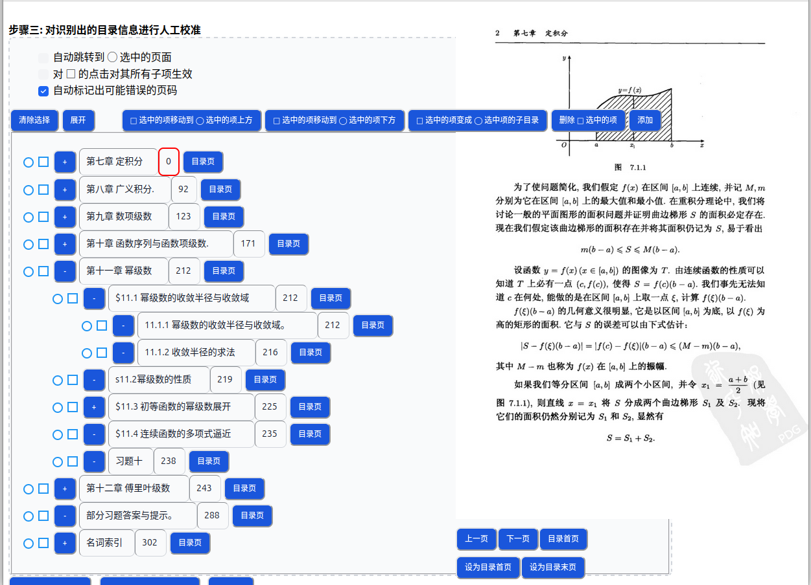
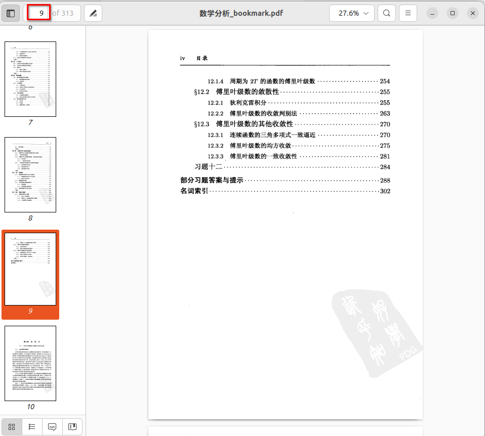

# PDF 扫描件加书签步骤

## 1 支持的功能

-   从目录页识别出文字和页码信息
-   生成树状目录，并添加树状书签到 PDF 中
-   支持人工校准，提供便捷的跳转和预览，方便校准

## 2 操作演示

选择 PDF 文件并配置页码信息:

高清版：[配置页码信息视频](./images/start.webm)

编辑识别出的目录信息，生成带书签文件:

高清版：[目录编辑视频](images/edit.webm)

## 3 PDF 文件确认

确认 PDF 为扫描件，且包含目录页。

## 4 确认目录页码范围

确认目录首页对应的 PDF 页码

如图为第 6 页。

确认目录末页对应的 PDF 页码

如图为第 9 页。

## 5 确认正文页对应的 PDF 页码，及对应的正文实际页面

如图为某一正文页，只需找到一个含有页码的正文页即可， 其对应的 PDF 页码为第 11 页，对应正文实际页码为第 2 页。

注意这一步很重要，设置错误会导致书签跳转位置不正确。

## 6 在 PDF 加书签工具网站上操作

1.  将上面识别到的页码信息录入
    
    

2.  输入文件页面信息后，点击 `更新` ， 将会对目录页面进行扫描， 识别出目录页的页码跳转信息，如图：
    
    

3.  目录扫描成功后，将会显示扫描到的目录结果。
    
    
    
    其中标注红色框的页面为可能识别错误的页面，需要手动调整修改，修改时点击 `目录页` ， PDF 预览页将会自动跳转到该条目对应的目录页，找到正确的页码修改即可。
    
    `自动跳转到 ◯ 选中的页面` 选中后，每次点击 `◯` , PDF 预览页面将自动跳转到书签对 应的目标页面，此功能可以快速检查跳转是否正确，有些 PDF 文件可能缺失部分页面， 会引起书签跳转不正确的问题。
    
    其它按钮主要用于对目录树的编辑，在此略去。
    
    编辑完成后，点击 `保存` ，将保存的书签文件上传到服务器上，下次再编辑时点击 `获取修改过的目录` ，会从服务器上下载上次保存的书签文件显示。
    
    

4.  编辑和校准后，点击 `生成书签文件` ，会下载生成的带书签文件。

5.  最后可选择 `清空` ，将在服务器端删除 PDF 及其书签文件。

另外，如果发现扫描出的目录项有缺失，可以点击 `增加新目录项` ， 将可以在文本框中手动输入多条目录项，增加到在编辑的目录树中。

